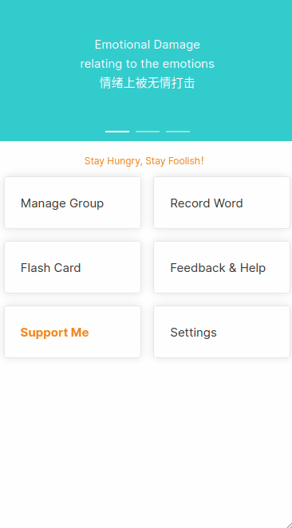

# Stylish Reader 英语学习软件

作为一个英语学习的爱好者，我深知单词对于英语学习的重要性。这也是这款软件创建的初衷，希望它能够成为英语爱好者们的好帮手。

## 功能列表

- 创建单词组
- 在单词组中加入新单词
- 输入单词，自动查询单词中英文、发音、例句，方便加入单词组
- 自动循环播放单词组中的单词
- flash card 方式背单词

## 计划开发的功能

具体可以参照 [Issues 列表](https://github.com/tolerious/Stylish-Reader-APP/issues)中的 `Enhancement` 标签。

## ScreenShot

